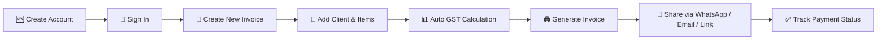

<div align="center">


<h3>Invoice Smarter. Get Paid Faster.</h3>


<br/>

<a href="https://shahrishabh1513-jsk.github.io/RT-invoice-generator/"></a>
<a href="https://github.com/shahrishabh1513-jsk/RT-invoice-generator"></a>
<a href="https://github.com/shahrishabh1513-jsk/RT-invoice-generator/stargazers"></a>

<br/><br/>


<br/>


</div>

<br/>

<table align="center">
<tr>
<td align="center" width="20%"><sub>INVOICES</sub><br><b>Unlimited</b></td>
<td align="center" width="20%"><sub>PRICING</sub><br><b>100% Free</b></td>
<td align="center" width="20%"><sub>TAX SUPPORT</sub><br><b>GST · CGST · SGST</b></td>
<td align="center" width="20%"><sub>SHARING</sub><br><b>WhatsApp · Email · Link</b></td>
<td align="center" width="20%"><sub>HOSTING</sub><br><b>GitHub Pages</b></td>
</tr>
</table>

<div align="center">

[](#-live-preview)
[](#-about-the-project)
[](#-key-features)
[](#-site-map)
[](#-workflow)
[](#️-tech-stack)
[](#-folder-structure)
[](#-getting-started)
[](#-connect)

</div>

<div align="center"></div>

## 🔍 Live Preview

<div align="center">

<a href="https://shahrishabh1513-jsk.github.io/RT-invoice-generator/" target="_blank">

</a>

<sub>👆 Click to explore the live app</sub>

<br/><br/>

<a href="https://shahrishabh1513-jsk.github.io/RT-invoice-generator/" target="_blank">
  
</a>

</div>

> 💡 First-load screenshots can occasionally appear blank on `mshots` before the cache warms up — refresh once if that happens; it self-corrects within a minute.

<div align="center"></div>

## 📖 About The Project

**RT Invoice** is a smart, fully responsive **billing and invoicing web app** that lets freelancers and small businesses create professional, GST-ready invoices in seconds. It handles real-time tax calculations (GST, CGST, SGST), client management, and instant sharing — all from a clean, modern dashboard-style interface.

This project was built to practice **SaaS-style product design** — authentication flows, dashboard UI, real-time calculation logic, and document generation — built entirely with **HTML, CSS, and JavaScript**.

> 💬 *"Invoice smarter, get paid faster."*

<div align="center">

| | |
|---|---|
| 🧾 **Type** | Billing / Invoicing Web App |
| 🎯 **Built For** | Freelancers & small businesses |
| 💰 **Tax Support** | GST · CGST · SGST ready, real-time calculation |
| 🔗 **Sharing** | WhatsApp, Email, or shareable link |
| 🖨️ **Extras** | Print-ready templates & digital signature support |

</div>

<div align="center"></div>

## ✨ Key Features

<table>
<tr>
<td width="50%" valign="top">

### 🧾 Invoice Creation
- ⚡ Real-time invoice total calculations
- 📊 GST, CGST & SGST auto-calculation
- 🖨️ Print-ready invoice templates
- ✍️ Digital signature support

</td>
<td width="50%" valign="top">

### 🔗 Sharing & Tracking
- 📱 One-tap sharing via WhatsApp, Email, or Link
- ✅ Payment status tracking (e.g. "Paid")
- 📈 Grand total & invoice summary dashboard
- ♾️ Unlimited invoices, 100% free

</td>
</tr>
<tr>
<td width="50%" valign="top">

### 🔐 Accounts
- 🔑 Sign In with email & password
- 🆕 Free account creation
- 🎯 Demo account for instant testing
- 👁️ Password visibility toggle

</td>
<td width="50%" valign="top">

### 🎨 Design & UX
- 📱 Fully **responsive**, mobile-friendly
- 🎨 Soft, clean "smart billing studio" UI
- 🪪 Branded stamped-seal logo mark
- ⚡ Lightweight, fast-loading interface

</td>
</tr>
</table>

<div align="center"></div>

## 🗺️ Site Map

<div align="center">

| Page | Description |
|:---:|---|
| 🏠 **Home** (`index.html`) | Landing page, feature highlights & auth entry points |
| 🔐 **Sign In** (`login.html`) | Account login with demo account autofill |
| 📝 **Create Account** (`signup.html`) | New user registration |
| 🧾 **Dashboard / Invoice Editor** | Create, edit & manage invoices *(post-login)* |

</div>

<div align="center"></div>

## 🧭 Workflow



<div align="center"></div>

## 🛠️ Tech Stack

<div align="center">

| Category | Technology | Purpose |
|:---:|:---:|:---|
| **Markup** |  | Semantic page structure |
| **Styling** |  | Responsive dashboard-style layouts |
| **Interactivity** |  | Real-time calculations, auth & invoice logic |
| **Version Control** |   | Source control |
| **Deployment** |  | Live hosting |

</div>

<div align="center"></div>

## 📂 Folder Structure

<details>
<summary><b>Click to expand the folder structure 📁</b></summary>

```bash
RT-invoice-generator/
│
├── assets/
│   ├── logo.svg                    # RT Invoice stamped-seal logo
│   └── icons/                        # UI icons
│
├── index.html                          # Home / landing page
├── login.html                            # Sign In page
├── signup.html                             # Create Account page
├── dashboard.html                            # Invoice dashboard (post-login)
├── invoice-editor.html                         # Create / edit invoice
│
├── css/
│   └── style.css                                  # All styles
│
├── js/
│   ├── auth.js                                        # Login / signup logic
│   ├── calculations.js                                    # GST / CGST / SGST calculation logic
│   ├── invoice.js                                             # Invoice creation & templates
│   └── share.js                                                   # WhatsApp / Email / link sharing
│
└── README.md                                                          # Project documentation
```

</details>

<div align="center"></div>

## 🚀 Getting Started

```bash
# 1️⃣ Clone the repository
git clone https://github.com/shahrishabh1513-jsk/RT-invoice-generator.git

# 2️⃣ Navigate into the project directory
cd RT-invoice-generator

# 3️⃣ Open index.html in your browser
#    (or use the Live Server extension in VS Code)
```

✅ No build tools, dependencies, or installations required — it's a pure **HTML/CSS/JS** project.

**🎯 Want to try it instantly without signing up?** Use the demo account on the live site:
```
Email:    demo@rtinvoice.com
Password: password123
```

<div align="center"></div>

## 🧭 Roadmap

- [x] Landing page with feature highlights
- [x] Sign In / Sign Up with demo account
- [x] Real-time GST/CGST/SGST calculation
- [x] Invoice sharing via WhatsApp, Email & Link
- [ ] 🔧 Backend integration for persistent invoice storage
- [ ] 📊 Analytics dashboard (revenue trends, top clients)
- [ ] 💳 Online payment collection
- [ ] 🌙 Dark mode

<div align="center"></div>

## 🤝 Connect

<div align="center">

**Rishabh Alpeshabhai Shah**

<a href="https://rishabh-shah-portfolio.netlify.app/"></a>
<a href="https://www.linkedin.com/in/rishabh-alpeshabhai-shah-91b9072a6/"></a>
<a href="mailto:shahrishu1515@gmail.com"></a>
<a href="https://github.com/shahrishabh1513-jsk"></a>

</div>

---

<div align="center">

### ⭐ If you like this project, give it a star — it helps a lot!


<br/>

**Made with 🧾 & 💗 by Rishabh Shah**


</div>
